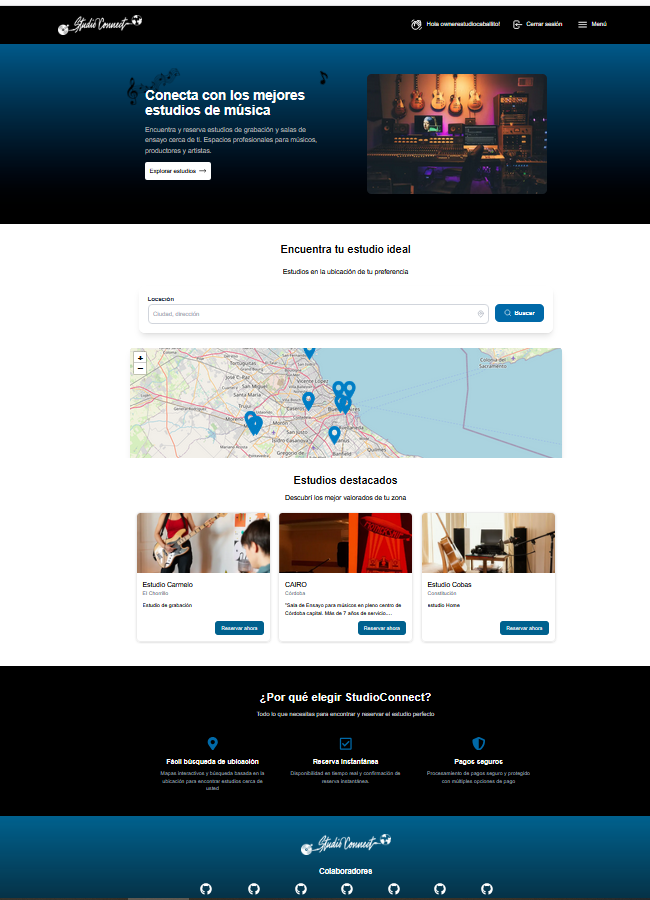
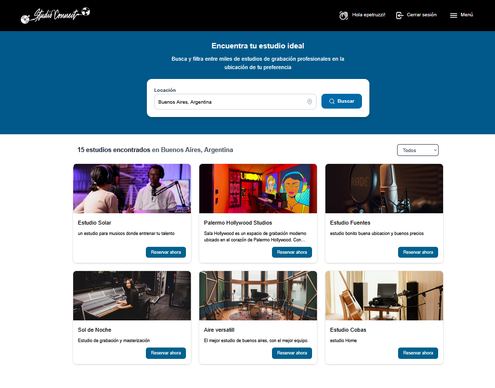
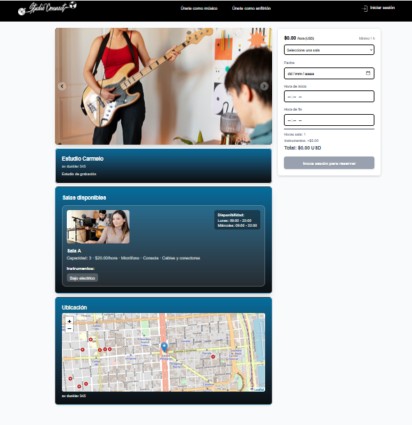
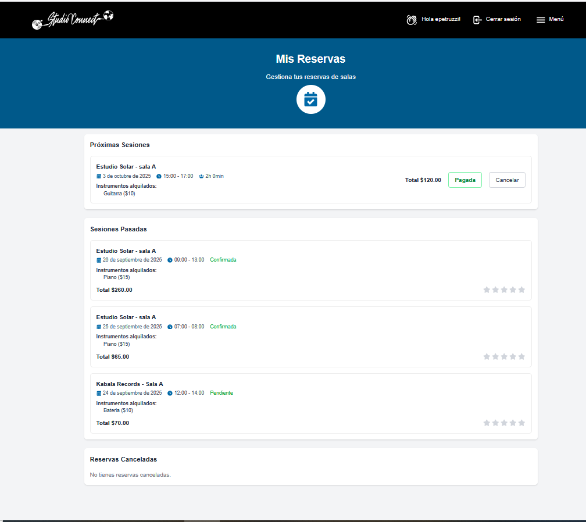
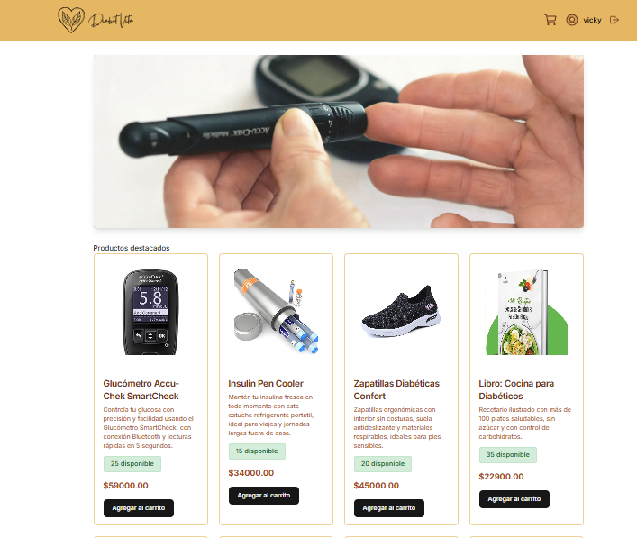
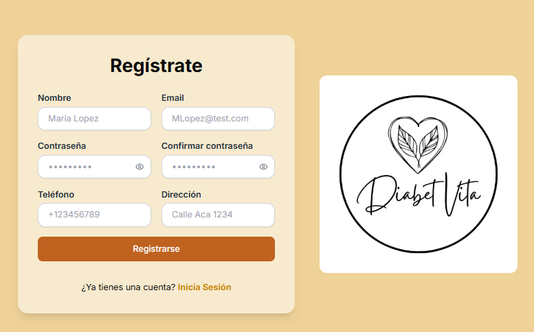
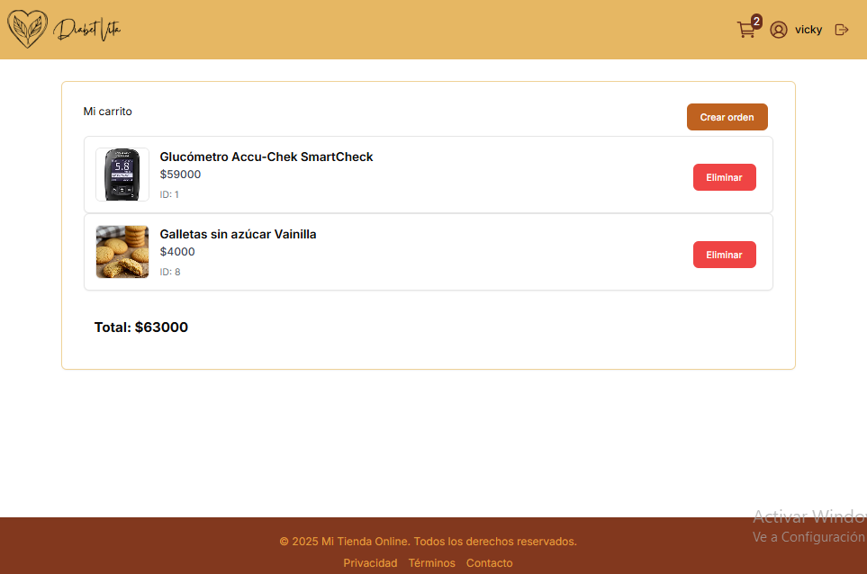
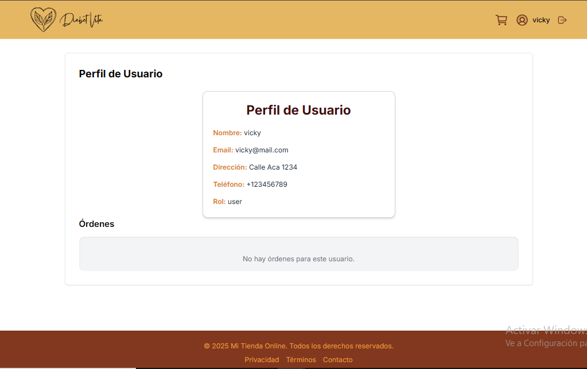

  <h1>¡Hola! 👋 Soy Vicky Gallo</h1>

---

<table align="center">
<tr>
<td width="50%" valign="top">
<h2>✨ Frontend Developer | React & Next.js</h2>

Soy una **desarrolladora frontend apasionada** por crear interfaces limpias, accesibles y escalables. 
Fusiono el pensamiento analítico con la creatividad, aportando soluciones innovadoras y **centradas en la experiencia de usuario (UX)**. 
 
✨ Gran compañera de equipo, paciente y organizada. 
He desarrollado mi carrera combinando la programación con una trayectoria de **+15 años** en la industria textil (comercial y producción).

<h3>🇺🇸 About Me</h3>

I'm a passionate **Frontend Developer** focused on building clean, accessible, and scalable interfaces with **React** and **Next.js**. 
I blend analytical thinking with creativity, bringing innovative and user-centric solutions. Experienced in teamwork, patient, and highly organized.

 

<h2>📫 Contáctame</h2>

📧 **Email:** <a href="mailto:vickievike@hotmail.com">vickievike@hotmail.com</a> 
💼 **LinkedIn:** <a href="https://www.linkedin.com/in/victoriagallo">linkedin.com/in/victoriagallo</a> 
🌐 **Portfolio (Coming Soon):** victoriagallo.dev

</td>

<td width="50%" valign="top">
<h2>🛠️ Mi Stack de Tecnología</h2>

<h2>🌱 Más sobre mí</h2>
<ul>
<li>🌍 **Ubicación:** Buenos Aires, Argentina</li>
<li>👩‍👧 **Familia:** Mamá de Renata y esposa de Nicolás ❤️</li>
<li>🎨 **Trayectoria:** Diseñadora de Indumentaria con +15 años de experiencia.</li>
<li>🌿 **Intereses:** Amante de la naturaleza, Vegetariana, Yoga y Cultura.</li>
</ul>

<h2>🎓 Educación</h2>
<ul>
<li>**Soy Henry:** Bootcamp Full Stack Web Developer (2025). 800+ horas de programación intensiva.</li>
<li>**Universidad de Buenos Aires (UBA):** Diseño de Indumentaria (2011).</li>
</ul>
</td>
</tr>
</table>

---
---
## 🚀 Proyectos Destacados

Esta es una selección de mis proyectos más relevantes que demuestran mi capacidad para construir soluciones completas y funcionales.

### 💎 StudioConnect – Reservas de estudios musicales (Proyecto Estrella)
* **Descripción:** Plataforma dinámica para la gestión y reserva de estudios de grabación. Proyecto final Full-Stack.
* **Funcionalidades:** Administración de usuarios y estudios, Calendario dinámico de reservas, Pagos integrados con **Stripe**.
* **Tecnologías:** React, Next.js, PostgreSQL.
* 🔗 [**Repositorio**](https://github.com/VickyGallo/proyecto-final-StudioConnect.git) | 🌐 [**Demo**](https://studioconnect-front.vercel.app/)

### 🛒 DiavetVita – E-commerce de productos dietéticos
* **Descripción:** E-commerce escalable para la venta de productos dietéticos con un enfoque en accesibilidad y experiencia de compra.
* **Funcionalidades:** Carrito de compras, filtros de búsqueda avanzados, perfiles de usuario.
* **Tecnologías:** React, TypeScript, Tailwind CSS.
* 🔗 [**Repositorio**](https://github.com/VickyGallo/proyecto-ecommerce-diavetvita.git)

### 🎵 The Music Box – Gestión de eventos musicales
* **Descripción:** Sistema de gestión para eventos o reservas de locales y artistas.
* **Tecnologías:** JavaScript, React, Node.js (indicar el stack principal).
* 🔗 [**Repositorio**](https://github.com/VickyGallo/proyecto-turnos-themusicbox.git)

---

## 🖼️ Vistas de la app (StudioConnect)

Aquí te muestro las vistas principales del proyecto **StudioConnect**.

| Home | Búsqueda | Detalle de estudio | Mis reservas |
| :---: | :---: | :---: | :---: |
|  |  |  |  |

---
## 🖼️ Vistas Clave de la Aplicación

Aquí te muestro las pantallas más importantes que reflejan la experiencia de usuario y las funcionalidades del e-commerce DiavetVita.

| Home | Catálogo y Filtrado | Carrito de Compras | Perfil de Usuario |
| :---: | :---: | :---: | :---: |
|  |  |  |  |
